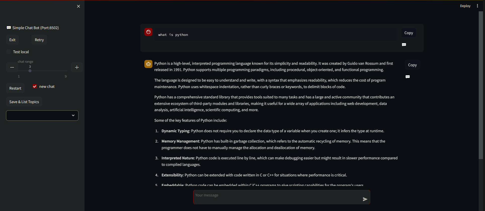

# simple_chat_bot
chat bot: AzureOpenAI + streamlit

**Use streamlit==1.29.0 as we will export executable app with pyinstaller.**

## install

```sh
## clone the repo:
git clone https://github.com/chinsaiki/simple_chat_bot.git

## create python environment, example with anaconda:
conda create -n chatbot python=3.9
conda activate chatbot

cd simple_chat_bot

## install modules:
pip install -r requirements.txt 
#for those in China(用国内源): 
pip install -r requirements.txt -i https://pypi.tuna.tsinghua.edu.cn/simple

## set AzureOpenAI parameters:
cp .env.example .env  #change 'cp' to 'copy' in Windows
#EDIT .env

## run:
streamlit run main.py
```

## demo



## export executable app

Perform the following steps in the directory simple_chat_bot.

* install pyInstaller in your python environment:

    ```sh
    pip install pyInstaller
    ```

* make ```simpleChatBot.spec```:

   ```sh
   cp simpleChatBot.spec.example simpleChatBot.spec  #change 'cp' to 'copy' in Windows
   #or you can make simpleChatBot.spec by command:
   #pyinstaller --onefile --additional-hooks-dir=./hooks simpleChatBot.py --clean
   ```

   edit ```simpleChatBot.spec``` file: 
   
   * replace 'C:/ProgramData/Anaconda3/envs/chatbot/Lib' to the path of your python environment. 
     
     (the path should be like '/data/anaconda3/envs/chatbot/lib/python3.9' on Linux.)


* edit ```cli.py``` file inside the ```streamlit\web``` folder of your python environment:

    In my environment that file is:

    ```
    #on Windows
    C:\ProgramData\Anaconda3\envs\chatbot\Lib\site-packages\streamlit\web\cli.py
    #on Linux:
    /data/anaconda3/envs/chatbot/lib/python3.9/site-packages/streamlit/web/cli.py
    ```

    Add next code block to cli.py file:

    ```python
    def _main_run_clExplicit(file, command_line, args=[],flag_options={}):
        main._is_running_with_streamlit = True
        bootstrap.run(file, command_line, args,flag_options)

    ##right before:
    ##if __name__ == "__main__":
    ```

* build executable program:
  
    ```sh
    pyinstaller simpleChatBot.spec --clean
    ```

* copy ```main.py``` file to dist folder, copy ```.streamlit``` folder to dist folder.

* publish the whole folder ```dist``` as the app.

  create a .env file under ```dist``` before call ```dist/simpleChatBot.exe```.

* pyInstaller + streamlit [reference](https://github.com/jvcss/PyInstallerStreamlit/tree/master)

